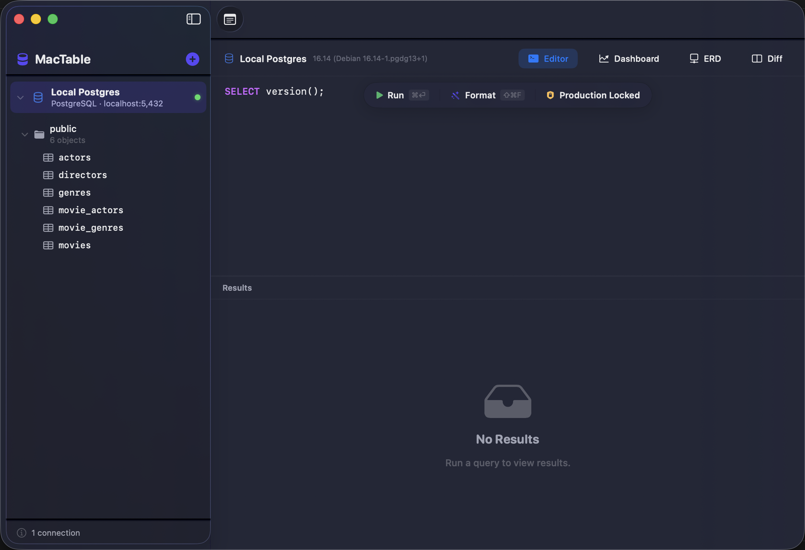
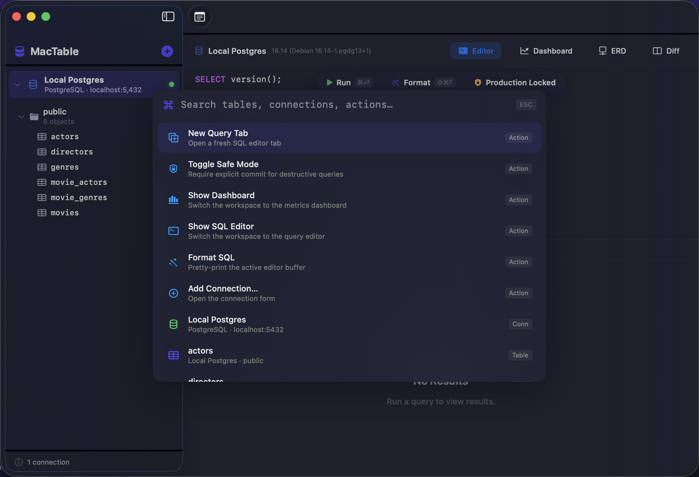
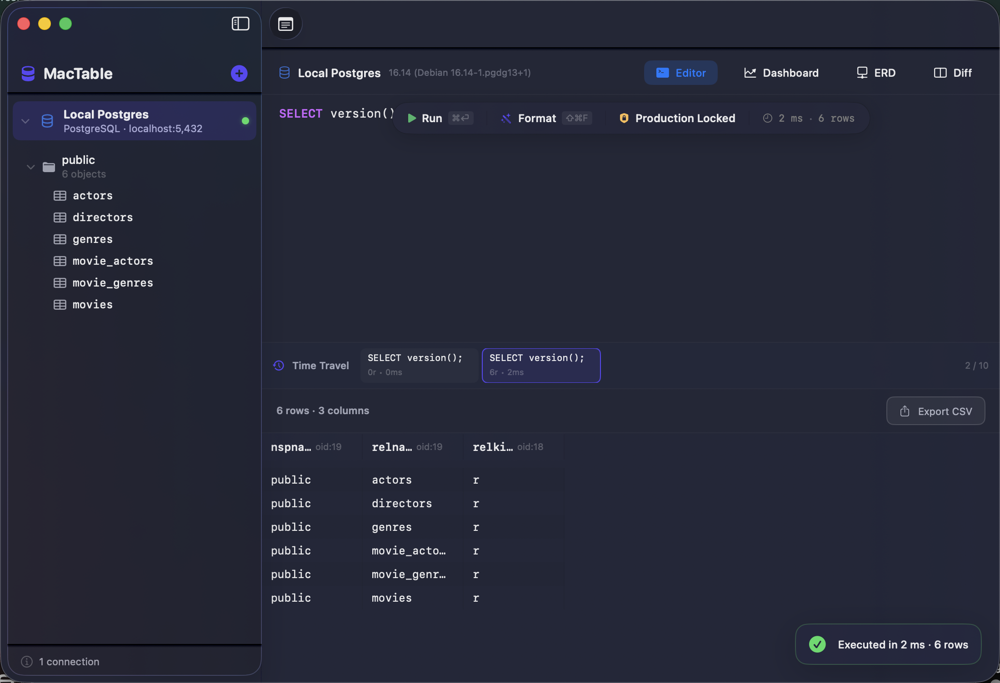
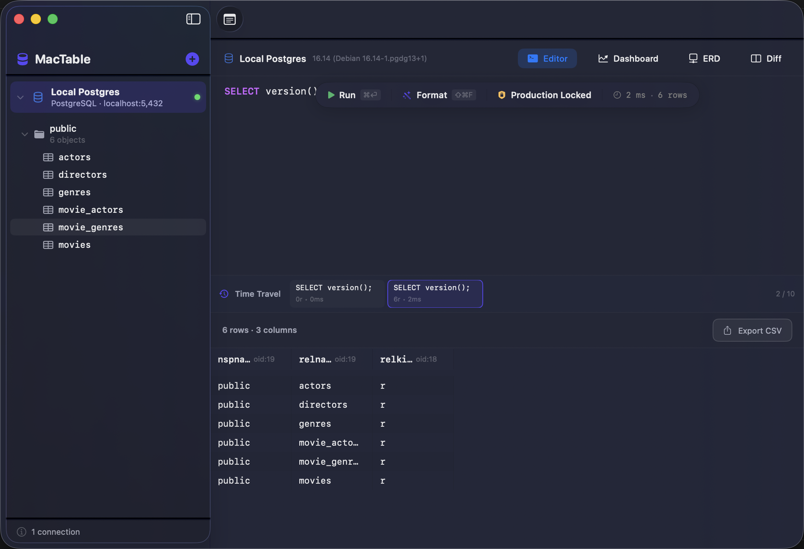

  

<h1 align="center">MacTable</h1>

  A beautiful, blazing-fast database client built exclusively for macOS.

  
  
  

---

## What is MacTable?

MacTable is a native macOS application for managing your databases. It connects directly to PostgreSQL, MySQL, and MongoDB servers and gives you a premium workspace to browse tables, write queries, visualize schemas, and monitor performance — all from one window.

It's designed to feel like it belongs on your Mac. Translucent materials, smooth spring animations, keyboard shortcuts, and attention to every pixel make it a joy to use every day.

---

## Features

### 🔌 Multi-Database Connections

Connect to PostgreSQL, MySQL, or MongoDB in seconds. Your credentials are stored securely in the macOS Keychain — never written to disk in plain text. A one-click "Test Connection" button verifies your setup before saving.

---

### 🗂️ Hierarchical Schema Navigator

Browse your databases the way you think about them. The sidebar presents a clean tree: **Connection → Database → Schema → Tables & Views**. Expand any node to instantly load its children from the server without blocking the interface. Hover effects and animated chevrons make navigation feel alive.

---

### ⌨️ Command Palette (⌘K)

Need to jump somewhere fast? Press **⌘K** to open the Command Palette — a Raycast-style overlay that searches across tables, schemas, saved queries, and app commands. Navigate results with your keyboard and hit Enter to jump instantly.

---

### 📝 Smart SQL Editor

Write queries in a professional-grade editor with syntax highlighting, intelligent autocomplete (table and column names from your live schema), and keyboard shortcuts:

- **⌘ Enter** — Execute the current query
- **⌘ T** — Open a new editor tab
- **⌘ Shift F** — Auto-format your SQL

A floating glass pill bar gives you quick access to Run, Format, and Safe Mode toggle without cluttering the interface.

---

### 📊 High-Performance Data Grid

Query results render in a dense, scrollable table optimized for thousands of rows. Features include:

- **Alternating row colors** for easy scanning
- **Sticky column headers** with click-to-sort
- **Double-click inline editing** — modify a cell value right in place
- **Right-click context menus** — copy as JSON, export rows, truncate tables

---

### 🛡️ Safe Mode

Worried about running destructive queries on production? Safe Mode catches `UPDATE`, `DELETE`, `DROP`, and other dangerous statements and requires explicit confirmation before they execute. A pulsing commit bar makes pending changes impossible to miss.

---

### ⏪ Query Time-Travel

Made a query 5 minutes ago and want to see those results again? The time-travel scrubber at the bottom of the results pane lets you scroll back through your last 10 query results — no need to re-run anything.

---

### 📈 Metrics Dashboard

Monitor your database health at a glance. The dashboard shows:

- **Active connections** count
- **Database size** on disk
- **Slowest queries** with execution times
- **Time-series charts** with smooth curves showing trends over time

Sparklines embedded directly in table rows give you historical context without leaving the data view.

---

### 🔗 Entity-Relationship Diagram (ERD)

Visualize your schema as an interactive node graph. Tables appear as cards with their columns listed, and foreign key relationships are drawn as connecting lines. The layout engine automatically arranges nodes to minimize overlap. Drag tables around to customize your view.

---

### 🔍 Schema Diff

Compare two database schemas side-by-side — perfect for checking what changed between staging and production. Additions are highlighted in green, removals in red, and modifications in amber. Generate migration scripts directly from the diff.

---

### 📓 Scratchpad Inspector

Every connection has its own built-in scratchpad — a Markdown-powered notes panel that slides out from the right edge. Jot down query snippets, document table structures, or keep reminders. Everything saves automatically and stays tied to that specific connection.

---

### 👥 Real-Time Collaboration

Share a session with teammates. MacTable supports WebSocket-based live sync with presence cursors — see where your colleagues are typing in real time. The underlying conflict resolution engine ensures edits never collide.

---

### 🎨 Designed for macOS

Every detail is crafted to feel native:

- **Translucent sidebar** with vibrancy that shows your desktop through
- **Spring-based animations** on every interaction — no jarring linear transitions
- **Hover effects** on buttons and list items for immediate feedback
- **Dark & Light mode** with full support for both appearances
- **Floating toast notifications** for non-blocking feedback (query timing, copy confirmations)
- **Empty states** with helpful guidance when there's nothing to show yet

---

## Supported Databases

| Database   | Status |
|------------|--------|
| PostgreSQL | ✅ Full support |
| MySQL      | ✅ Full support |
| MongoDB    | ✅ Full support |

---

## Requirements

- macOS 14 (Sonoma) or later
- Any Mac with Apple Silicon or Intel processor

---

## Keyboard Shortcuts

| Shortcut | Action |
|----------|--------|
| ⌘ K | Open Command Palette |
| ⌘ Enter | Execute Query |
| ⌘ T | New Editor Tab |
| ⌘ Shift F | Format SQL |
| ⌘ N | New Connection |

---
